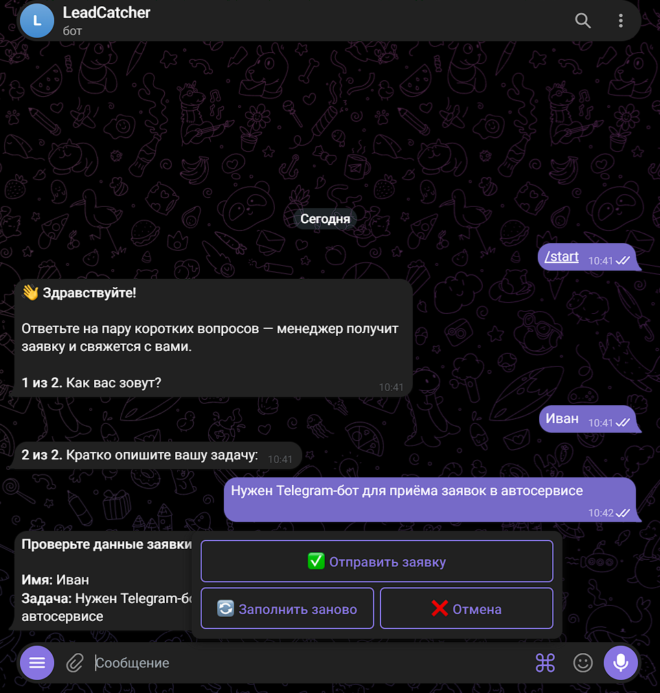
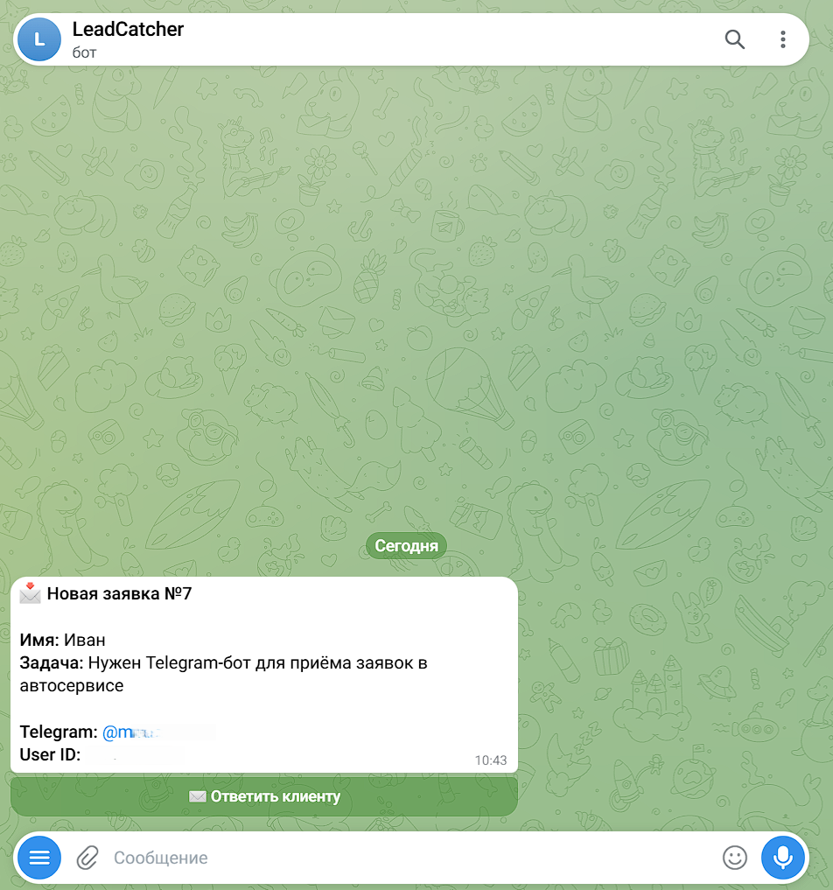
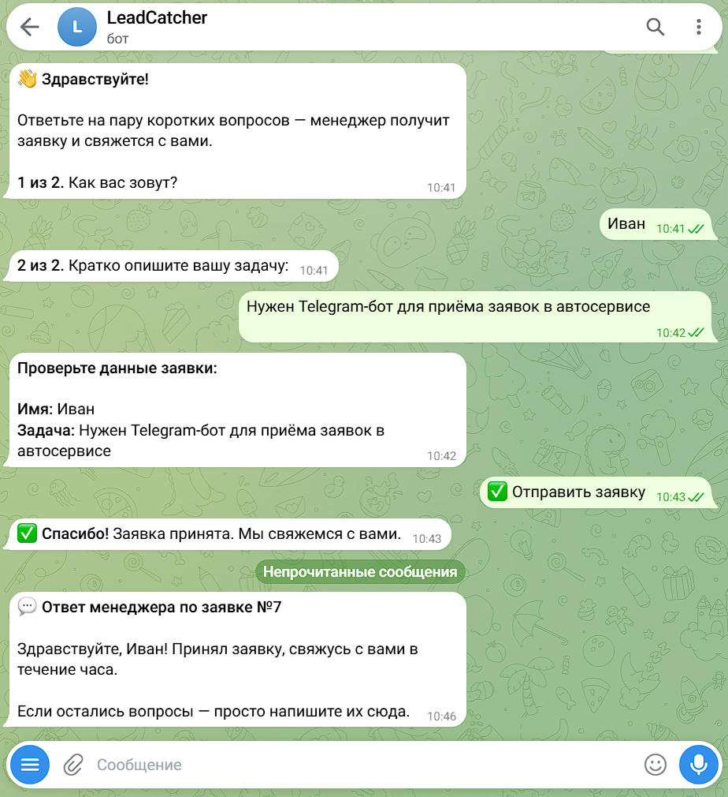

# Telegram Lead Collector Bot

Портфолио-проект Telegram-бота для автоматизации первичного сбора клиентских заявок. Бот проводит пользователя через короткую анкету, показывает данные перед отправкой, сохраняет заявку в SQLite и мгновенно уведомляет администратора.

## Возможности

- пошаговая анкета на FSM из двух вопросов (имя и задача);
- нормализация и валидация пользовательских данных;
- экран проверки перед отправкой заявки;
- отмена и повторное заполнение анкеты;
- надёжное сохранение в SQLite до отправки уведомления;
- **двусторонняя переписка администратора с клиентом прямо в боте**;
- inline-кнопка «Ответить клиенту» под каждой заявкой;
- пересылка сообщений клиента админу с привязкой к заявке;
- статусы заявок `new → notified → replied`;
- HTML-экранирование пользовательских данных;
- административная статистика по команде `/stats`;
- CSV-выгрузка заявок по команде `/export`;
- меню команд Telegram;
- журналирование и централизованная обработка ошибок;
- конфигурация через `.env` без секретов в исходном коде;
- неблокирующее выполнение SQLite-операций через `asyncio.to_thread`.

## Стек

- Python 3.11+
- aiogram 3.x
- SQLite 3
- python-dotenv

## Сценарий пользователя

1. Пользователь отправляет `/start`.
2. Бот последовательно спрашивает имя и описание задачи.
3. Пользователь проверяет введённые данные.
4. После подтверждения заявка сначала сохраняется в базе.
5. Администратор получает структурированное уведомление с inline-кнопкой «Ответить клиенту».

## Сценарий диалога с администратором

1. Под уведомлением о новой заявке нажмите **✉️ Ответить клиенту**.
2. Бот переведёт вас в режим ввода ответа. Отправьте текст одним сообщением (1–4000 символов).
3. Клиент получит сообщение от бота с текстом ответа.
4. Статус заявки в базе перейдёт в `replied`.
5. Если клиент после этого напишет в бот, его сообщение автоматически пересылается вам с заголовком, в котором указаны номер заявки и имя клиента.
6. Чтобы прервать ввод ответа, нажмите **↩️ Отменить ответ** или отправьте `/cancel`.

## Скриншоты





## Быстрый запуск

### 1. Клонирование и виртуальное окружение

```bash
git clone https://github.com/antbkka/tg-bot-lead-collector.git
cd tg-bot-lead-collector
python -m venv .venv
```

Активация в Windows:

```bat
.venv\Scripts\activate
```

Активация в Linux/macOS:

```bash
source .venv/bin/activate
```

### 2. Установка зависимостей

```bash
pip install -r requirements.txt
```

Модуль `sqlite3` входит в стандартную библиотеку Python и не требует установки.

### 3. Настройка окружения

Скопируйте `.env.example` в `.env` и замените значения:

```env
BOT_TOKEN=токен_от_BotFather
ADMIN_CHAT_ID=ваш_числовой_telegram_id
DATABASE_NAME=leads.db
LOG_LEVEL=INFO
```

- токен создаётся через [@BotFather](https://t.me/BotFather);
- числовой Telegram ID можно узнать через [@userinfobot](https://t.me/userinfobot);
- бот должен иметь возможность отправлять сообщения администратору: сначала откройте диалог с ботом и нажмите Start.

### 4. Запуск

```bash
python bot.py
```

При первом запуске бот автоматически создаст файл базы данных и таблицу `leads`.

## Команды

### Пользовательские

| Команда | Назначение |
|---|---|
| `/start` | Начать или перезапустить анкету |
| `/cancel` | Отменить заполнение |
| `/help` | Показать справку |

Если у пользователя уже есть хотя бы одна заявка, любое текстовое сообщение вне активной анкеты автоматически пересылается администратору как сообщение клиента по его последней заявке. Если заявок ещё нет, бот отвечает подсказкой `/start` и не пересылает ничего.

### Административные

Административные команды проверяют Telegram ID отправителя:

| Команда | Назначение |
|---|---|
| `/stats` | Количество заявок: всего, за 24 часа, новых без ответа, с ответом менеджера |
| `/export` | Получить все заявки в CSV с UTF-8 BOM |

Дополнительно в чате с ботом администратору доступны:

- inline-кнопка **✉️ Ответить клиенту** под каждой заявкой — включает режим ввода ответа;
- кнопка **↩️ Отменить ответ** — выход из режима ответа без отправки.

## Структура проекта

```text
tg-bot-lead-collector/
├── bot.py                # приложение, FSM, база данных и обработчики
├── requirements.txt      # зависимости исполнения
├── requirements-dev.txt  # зависимости для разработки (pytest, ruff)
├── .env.example          # шаблон конфигурации
├── .gitignore            # исключения Git
├── LICENSE               # лицензия MIT
├── docs/
│   └── screenshots/      # скриншоты для README
└── README.md             # документация
```

Проект намеренно оставлен компактным и запускается из одного Python-файла, но внутри кода разделён на слои: конфигурация, репозиторий SQLite, бизнес-функции и Telegram-обработчики.

## Надёжность и безопасность

- токен не хранится в Git;
- SQL-запросы параметризованы;
- данные пользователей экранируются перед вставкой в HTML;
- заявка сохраняется до попытки уведомить администратора;
- статус доставки уведомления хранится в базе;
- SQLite работает в WAL-режиме;
- ошибки API и БД записываются в лог без показа технических деталей пользователю.

> Для production с несколькими экземплярами приложения FSM-хранилище следует заменить на Redis, SQLite — на PostgreSQL, а polling — на webhook за reverse proxy.

## Идеи дальнейшего развития

- статусы обработки заявки и inline-кнопки администратора;
- повторная доставка неотправленных уведомлений;
- Dockerfile и CI/CD;
- интеграция с CRM или Google Sheets;
- антиспам и ограничение частоты запросов;
- мультиязычность.

## Автор

Проект создан как демонстрация навыков разработки Telegram-ботов на Python: асинхронная архитектура, aiogram FSM, SQLite, валидация, безопасность и эксплуатационная документация.

## Лицензия

Распространяется по лицензии MIT. Подробности в файле `LICENSE`.
